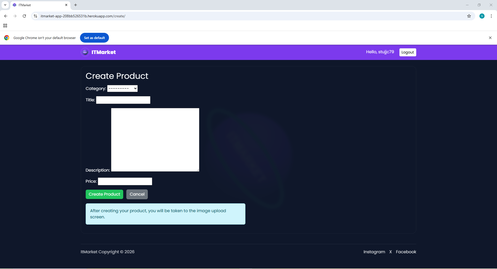
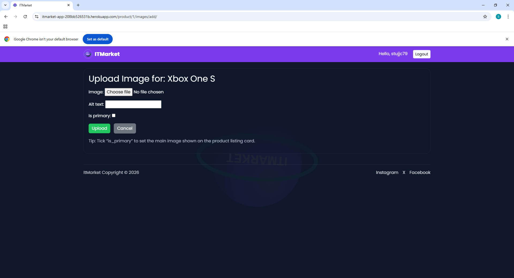
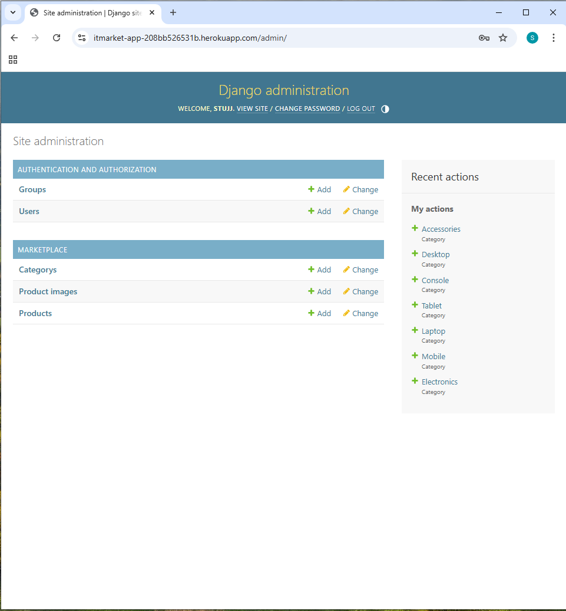
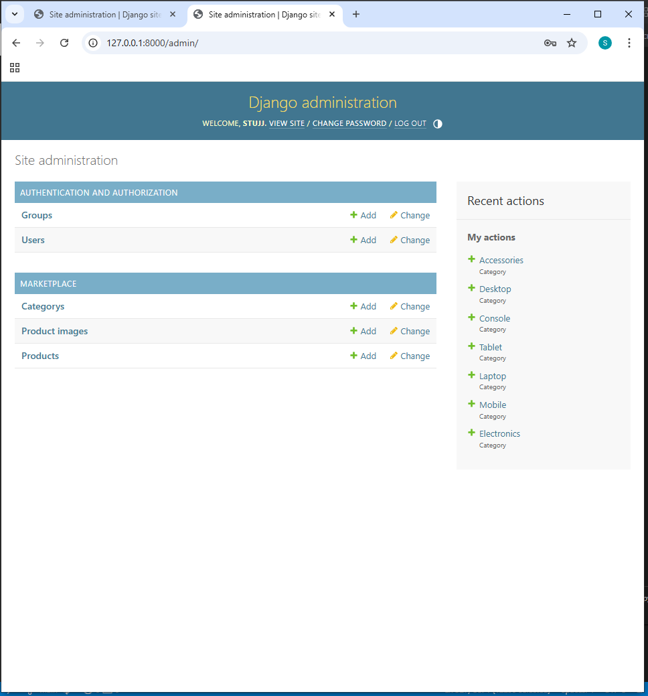
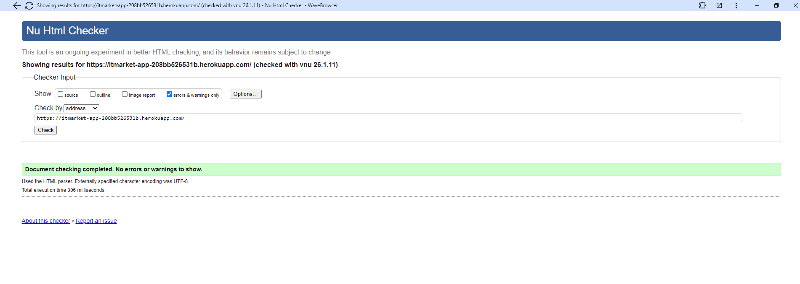
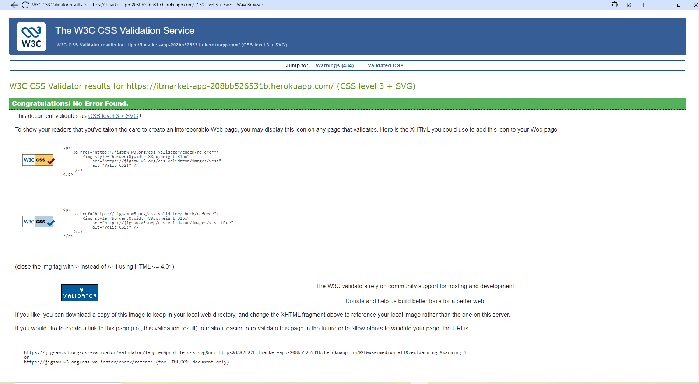

ITMarket
AI-Augmented Full-Stack Django Marketplace

     
 
 <strong>A secure, responsive, AI-augmented marketplace for buying and selling modern technology products.</strong> 
 
 <a href="https://itmarket-app-208bb526531b.herokuapp.com">Live Application</a> · <a href="https://github.com/cstuart756/itmarket">GitHub Repository</a> 

Project Overview

ITMarket is a full-stack marketplace web application built with Django 4.2 (LTS) and Python 3.11.
It enables authenticated users to buy and sell modern technology products including consoles, laptops, desktops, gaming PCs, phones, tablets, and accessories.

The application implements secure authentication, ownership-based authorisation, database-driven CRUD workflows, production-safe media storage, and cloud deployment.

This project was developed as the Individual Capstone Project for the AI-Augmented Full-Stack Bootcamp.

Key Capabilities

Full-stack Django (MTV) architecture

Secure authentication and authorisation

Ownership-based access control

Database-backed CRUD functionality

Cloudinary-hosted media uploads

Responsive UI across all device sizes

Search across multiple product fields

Production deployment with Heroku & PostgreSQL

Agile workflow using GitHub Projects

AI-assisted development with manual validation

Table of Contents

Deployed Application Proof

Authentication & Authorisation

Core CRUD Functionality

Media Handling & Cloudinary

Data Model (ERD)

UX Design & Wireframes

Admin & Content Management

Validation & Standards Compliance

Performance, Accessibility & SEO

Agile Project Management

Technologies Used

Automated Testing

Deployment

Bug Fix Log

AI-Assisted Development

Future Roadmap

References

Author & Declaration

1. Deployed Application Proof (LO3, LO6)
  
2. Authentication & Authorisation (LO3)
    
3. Core CRUD Functionality (LO3)
    
4. Media Handling & Cloudinary (LO3)
  
5. Data Model (ERD) (LO2)

6. UX Design & Wireframes (LO1)
Representative Responsive Planning
   
Full Wireframe Variants
       
7. Admin & Content Management (LO4)
  
8. Validation & Standards Compliance (LO5)
  
9. Performance, Accessibility & SEO (LO6)
   
10. Agile Project Management (LO7)

Technologies Used
Front-End

HTML5

CSS3

Bootstrap 5

Back-End

Python 3.11

Django 4.2 (LTS)

Database

SQLite (development)

PostgreSQL (production)

Media & Static

Cloudinary

Whitenoise

Automated Testing

Django TestCase suite covering:

Models

Views

Permissions

CRUD workflows

Messaging

Image rules

python manage.py test

Deployment

Heroku Web Dyno

Heroku PostgreSQL

Gunicorn

Whitenoise

Cloudinary

Production configuration includes HTTPS enforcement, secure cookies, and HSTS.

Bug Fix Log
Authentication Templates

Added BASE_DIR / "templates" to TEMPLATES['DIRS']

Implemented templates/registration/login.html

Correctly wired django.contrib.auth.urls

Result: Authentication pages render correctly locally and in production.

Database Persistence

Migrated from SQLite to Heroku PostgreSQL

Enforced DEBUG=False

Result: Data persists across dyno restarts.

AI-Assisted Development

AI tools were used for boilerplate generation, debugging, and test scaffolding.
All outputs were reviewed, adapted, and validated manually.

Future Roadmap

Advanced search and filtering

Sorting

User profiles

Reviews and ratings

Wishlist

Messaging

Admin analytics dashboard

Public REST API

Author

Stuart Carey
AI-Augmented Full-Stack Bootcamp
Individual Capstone Project

Declaration

This project is my own original work.
AI tools were used strictly as development assistants.
All architecture, security decisions, business logic, and implementation choices were designed, reviewed, and validated independently.