# ITMarket — AI-Augmented Full-Stack Django Marketplace

<p align="center">
  
  
  
</p>

<p align="center">
  <strong>A secure, responsive marketplace for buying and selling modern technology products.</strong>
</p>

<p align="center">
  <a href="https://itmarket-app-208bb526531b.herokuapp.com">Live Site</a> •
  <a href="https://github.com/cstuart756/itmarket">Repository</a>
</p>

---

## Project Overview

ITMarket is a full-stack marketplace web application built with **Django 4.2 (LTS)**, **Python 3.11**, **Bootstrap 5**, and **Cloudinary**.

It enables users to register, authenticate, and manage marketplace products using secure, database-backed CRUD workflows with ownership-based access control.

The platform is designed for buying and selling modern technology products including consoles, phones, tablets, laptops, desktops, gaming PCs, and accessories.

### Key Capabilities

- Full-stack Django (MTV) architecture
- Secure authentication and authorisation
- Media uploads using Cloudinary (production-safe storage)
- Responsive UI across desktop, laptop, tablet, and mobile
- Cloud deployment with Heroku + Postgres
- Agile workflow using GitHub Issues and Projects (Kanban)
- AI-augmented engineering workflow (with manual validation)

This project satisfies the requirements of the **AI-Augmented Full-Stack Bootcamp – Individual Capstone Project**.

---

## Table of Contents

- UX Design
- Wireframes
- Data Model (ERD)
- Features
- Technologies Used
- User Stories (MoSCoW)
- Agile Methodology
- Automated Testing
- Version Control
- Deployment (Heroku)
- Bug Fix Log
- Screenshots
- Lighthouse Performance Audits
- Project Management
- AI-Assisted Development
- Future Features & Roadmap
- References
- Author
- Declaration

---

## UX Design

### Design Goals

- Clean, intuitive interface for buyers and sellers
- Fully responsive across desktop, laptop, tablet, and mobile
- Accessibility-aware design with clear navigation and readable forms
- Bright and vivid colour palette for visual engagement
- Consistent feedback messages for all user actions

### Colour Scheme

| Purpose | Colour |
|------|------|
| Primary | `#FF2E63` |
| Secondary | `#08D9D6` |
| Dark Contrast | `#252A34` |
| Background | `#EAEAEA` |

### Typography

- Google Font: **Poppins**
- Applied consistently to headings and body text

---

## Wireframes

Wireframes illustrate the responsive design approach across device sizes.  
All wireframes are stored under:

docs/screenshots/wireframes/


### Mobile


### Tablet


### Laptop


### Desktop


---

## Data Model (ERD)

The Entity Relationship Diagram defines the database structure and relationships.


---

## Features

### Authentication & Authorisation

- User registration, login, logout
- Authentication state reflected in the navbar
- Ownership-based access control (only owners can edit or delete products)

### Marketplace

- View products in a responsive card layout
- Create, update, and delete products (authenticated users)
- Category assignment and display
- Cloudinary-backed image uploads
- Primary image selection logic
- Search by title, description, category, or seller

### Notifications

- Registration confirmation messages
- Product create, update, and delete confirmations
- Image upload and delete confirmations

---

## Technologies Used

### Front-End
- HTML5
- CSS3
- Bootstrap 5
- Google Fonts (Poppins)

### Back-End
- Python 3.11
- Django 4.2 (LTS)
- Django ORM

### Database
- SQLite (development)
- Heroku Postgres (production)

### Media & Static
- Cloudinary
- Whitenoise

### Tools & Platforms
- VS Code
- Git & GitHub
- Heroku
- Gunicorn

---

## User Stories (MoSCoW)

### MUST HAVE — Delivered
- User registration and login
- Browse products
- Create, update, and delete products
- Upload product images
- Primary image selection

### SHOULD HAVE
- Product search
- Category filtering
- Sorting
- User profiles

### COULD HAVE
- Reviews and ratings
- Wishlist
- Messaging
- Email notifications
- Public API

### WON’T HAVE (Current Scope)
- Payments and checkout
- Shipping and order tracking
- Real-time chat
- Mobile applications
- AI recommendations

---

## Agile Methodology

- GitHub Issues for user stories
- GitHub Projects for Kanban tracking
- Workflow: Backlog → To Do → In Progress → Done
- Incremental delivery with traceable commits

---

## Automated Testing

Django `TestCase` suite covering:

- Models
- Views
- Permissions
- CRUD workflows
- Messages
- Image rules

Run locally:

```bash
python manage.py test

Version Control

    Regular, incremental commits

    Meaningful commit messages

    .env excluded via .gitignore

    Secrets stored in Heroku Config Vars

Deployment (Heroku)
Stack

    Heroku web dyno

    Heroku Postgres

    Gunicorn

    Whitenoise

    Cloudinary

Production Settings

    DEBUG=False

    HTTPS enforced

    Secure cookies

    HSTS enabled

Bug Fix Log

Authentication Template Resolution

    Ensured TEMPLATES['DIRS'] includes BASE_DIR / "templates"

    Added templates/registration/login.html

    Correctly wired django.contrib.auth.urls

Result: Authentication pages render correctly locally and in production.

Database Persistence

    Migrated from SQLite to Heroku Postgres

    Enforced DEBUG=False

    Used persistent database storage

Result: Product and image data persists across dyno restarts.
## Screenshots

The following screenshots provide comprehensive visual evidence of application functionality, authentication flows, product management (CRUD), administration, validation, responsiveness, deployment, and performance auditing.

---

### Application Interface & Deployment


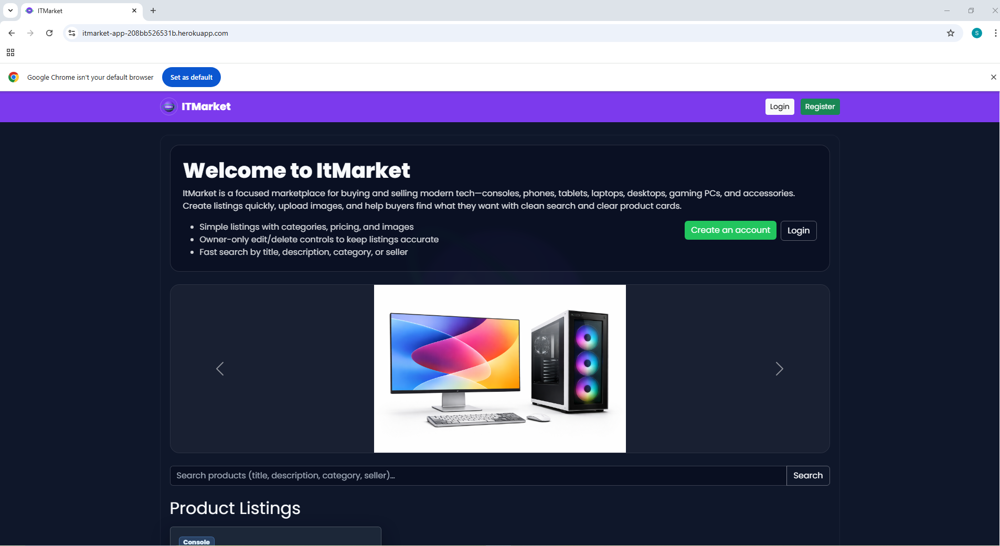
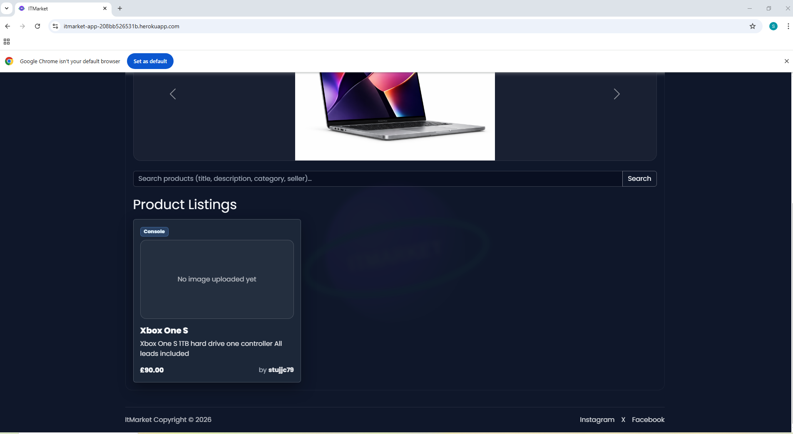

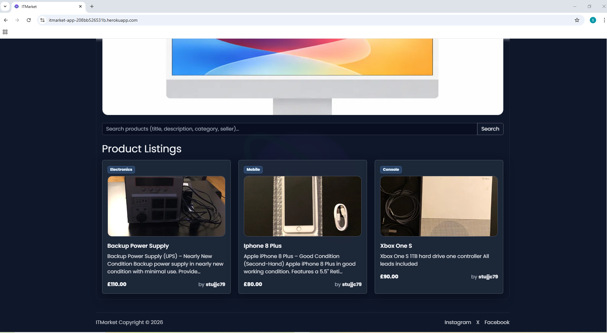

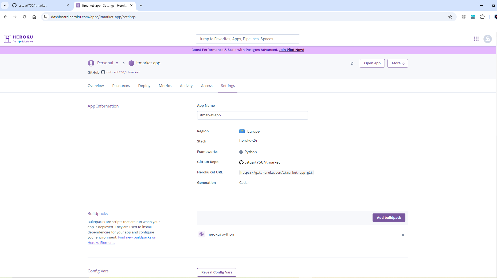


---

### Authentication & User Access


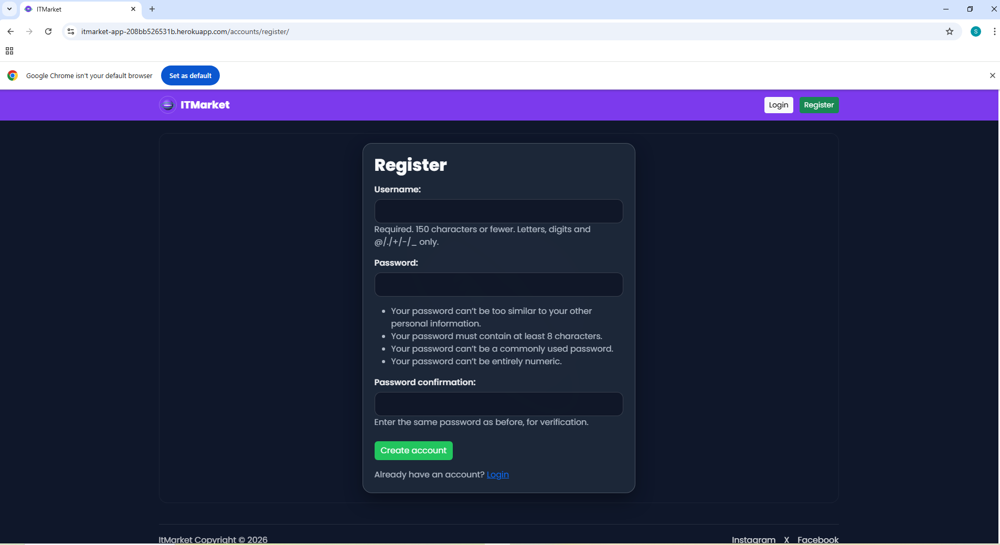


---

### Product Management (CRUD)

#### Create Product


#### Edit & Update Product

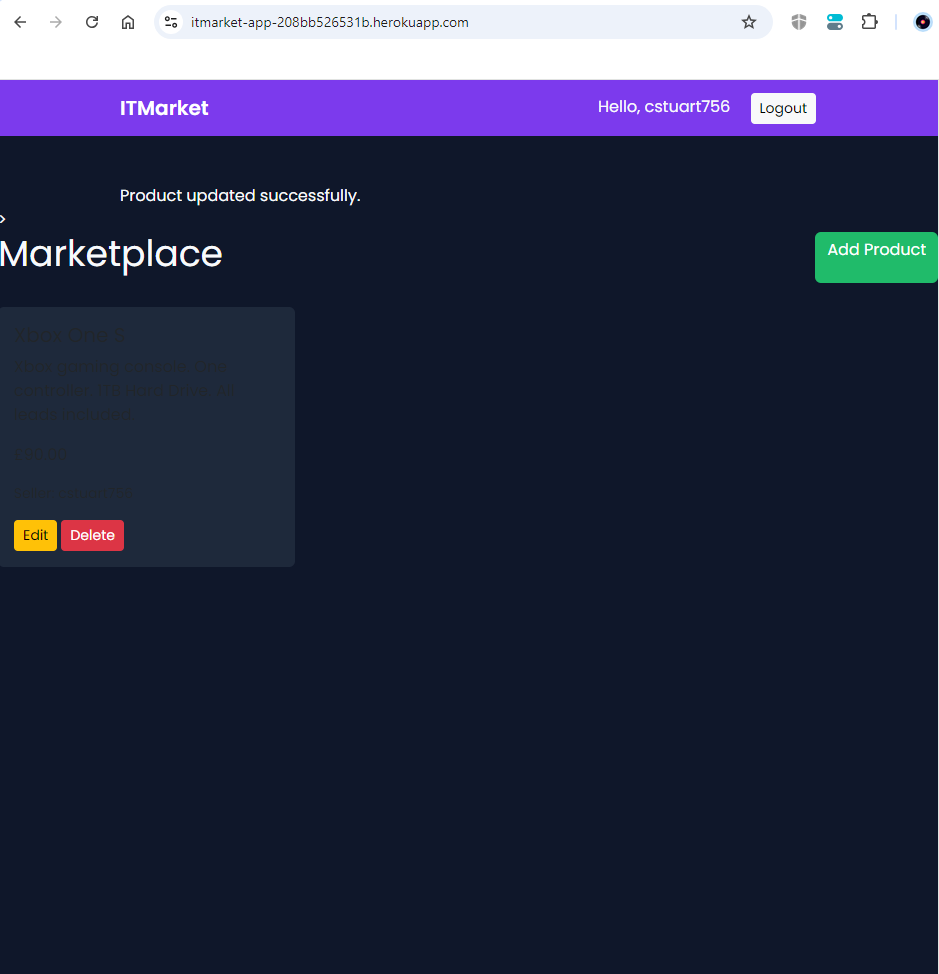


#### Delete Product


#### Product Listing & Media


---

### Administration (Django Admin)


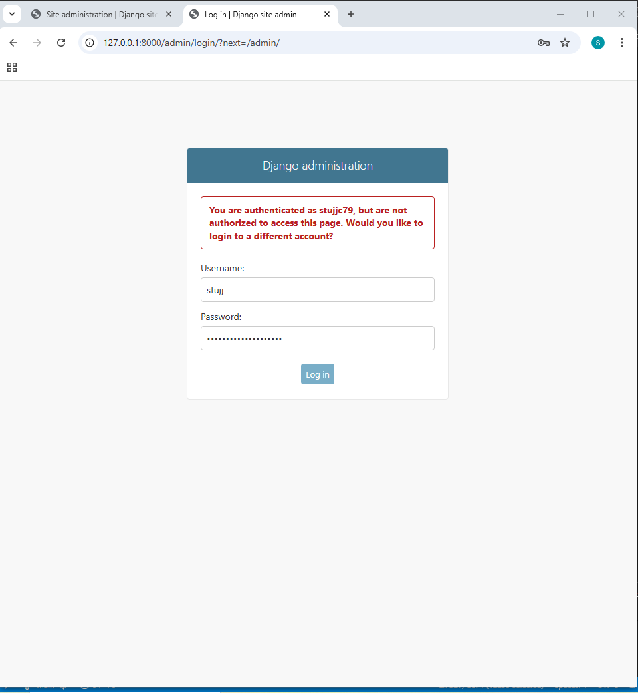

---

### Responsive Design Testing

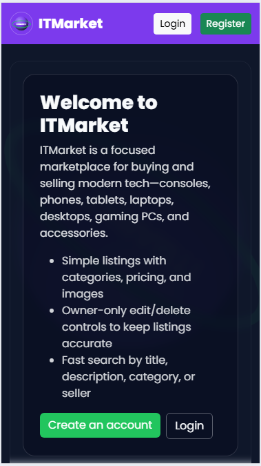
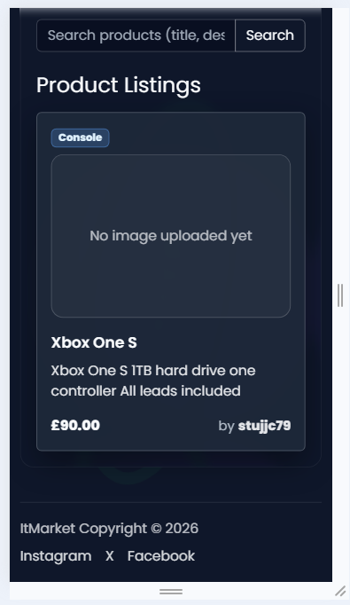

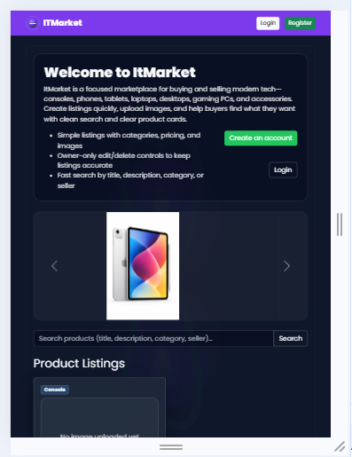
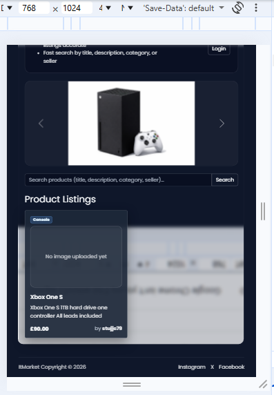

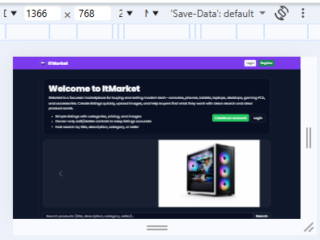
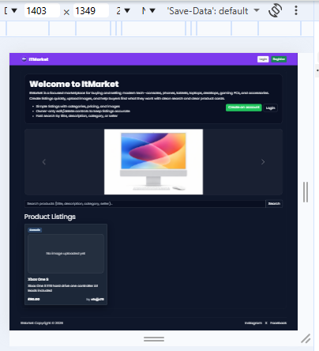

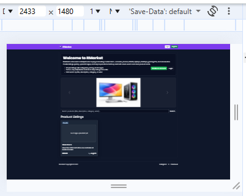

---

### Code Validation


---

## Lighthouse Performance Audits


---

## Project Management (Agile Workflow)


AI-Assisted Development

AI tools were used to assist with boilerplate generation, test creation, debugging, and UX decisions.
All outputs were reviewed, adapted, and validated via automated testing and manual verification.
Future Features & Roadmap
Phase 1

    Advanced search and filtering

    Sorting

    Image gallery

    User profiles

Phase 2

    Reviews and ratings

    Wishlist

    Messaging

Phase 3

    Admin dashboard

    Email notifications

    Public REST API

References

    Django Docs — https://docs.djangoproject.com/

    Bootstrap Docs — https://getbootstrap.com/docs/

    Cloudinary Docs — https://cloudinary.com/documentation

    Heroku Dev Center — https://devcenter.heroku.com/

    WCAG Guidelines — https://www.w3.org/WAI/standards-guidelines/wcag/

Author

Stuart Carey
AI-Augmented Full-Stack Bootcamp — Individual Capstone Project
Declaration

This project is my own original work.
AI tools were used strictly as development assistants. All architecture, security decisions, business logic, and implementation choices were designed, reviewed, and validated independently.