# ITMarket – AI-Augmented Full-Stack Django Web Application

## Live Site (Heroku)
Deployed application: https://itmarket-app-208bb526531b.herokuapp.com

## Repository
GitHub repository: https://github.com/cstuart756/itmarket

---

## Project Overview

**ITMarket** is a full-stack marketplace web application built with **Django 4.2 (LTS)**, **Python 3.11**, **Bootstrap 5**, and **Cloudinary**. It enables users to register, authenticate, and manage marketplace products with secure, database-backed **CRUD** workflows and ownership-based access control.

The platform is designed for buying and selling modern technology products such as **consoles, phones, tablets, laptops, desktops, gaming PCs, and accessories**.

### Key Capabilities
- Full-stack Django architecture (MTV pattern)
- Secure authentication & authorisation
- Media uploads using Cloudinary (production-safe storage)
- Responsive UI across desktop, laptop, tablet, and mobile
- Cloud deployment with Heroku
- Agile development workflow using GitHub Issues + Projects (Kanban)
- AI-augmented software engineering workflow (with manual validation)

This project satisfies the requirements of the **AI-Augmented Full-Stack Bootcamp Individual Capstone Project**.

---

## Table of Contents
- [UX Design](#ux-design)
- [Features](#features)
- [Technologies Used](#technologies-used)
- [Data Model](#data-model)
- [Agile Methodology](#agile-methodology)
- [Automated Testing](#automated-testing)
- [Version Control](#version-control)
- [Deployment (Heroku)](#deployment-heroku)
- [Bug Fix Log](#bug-fix-log)
- [Screenshots](#screenshots)
- [AI-Assisted Development (Reflection)](#ai-assisted-development-reflection)
- [Future Enhancements](#future-enhancements)
- [References](#references)
- [Author](#author)
- [Declaration](#declaration)

---

## UX Design

### Design Goals
- Clean, intuitive interface for buyers and sellers
- Fully responsive across desktop, laptop, tablet, and mobile
- Accessibility-aware design with clear navigation and readable forms
- Bright and vivid colour palette for visual engagement
- Consistent feedback messages for all user actions

### Colour Scheme

| Purpose | Colour |
|---|---|
| Primary | `#FF2E63` (Vibrant Pink) |
| Secondary | `#08D9D6` (Bright Teal) |
| Dark Contrast | `#252A34` |
| Background | `#EAEAEA` |

### Typography
- Google Font: **Poppins**
- Applied consistently to headings and body text

### Wireframes (Design Documentation)

Wireframes were produced to plan the responsive layout of the ITMarket marketplace application across major device form factors. They define:
- Layout structure
- Content hierarchy
- Navigation behaviour
- Interaction patterns

The designs follow a **mobile-first approach** and scale progressively using **Bootstrap’s responsive grid system**.

#### Device Layouts

**Desktop**
- Full-width navigation bar with authentication state
- Multi-column product grid (3–4 cards per row)
- Category and sorting controls above listings
- Prominent product images and action buttons

**Laptop**
- Reduced-width navigation bar
- Three-column product grid
- Centralised filters and controls
- Card-based layout with ownership action buttons

**Tablet**
- Collapsible navigation menu
- Two-column stacked product layout
- Touch-friendly buttons and spacing
- Optimised form layout for portrait orientation

**Mobile**
- Hamburger navigation menu
- Single-column product layout
- Large touch targets
- Stacked form inputs
- Optimised typography and spacing for small screens
---
## Wireframe Images

Wireframes are stored in `docs/screenshots/wireframes/`.

### Mobile

### Tablet
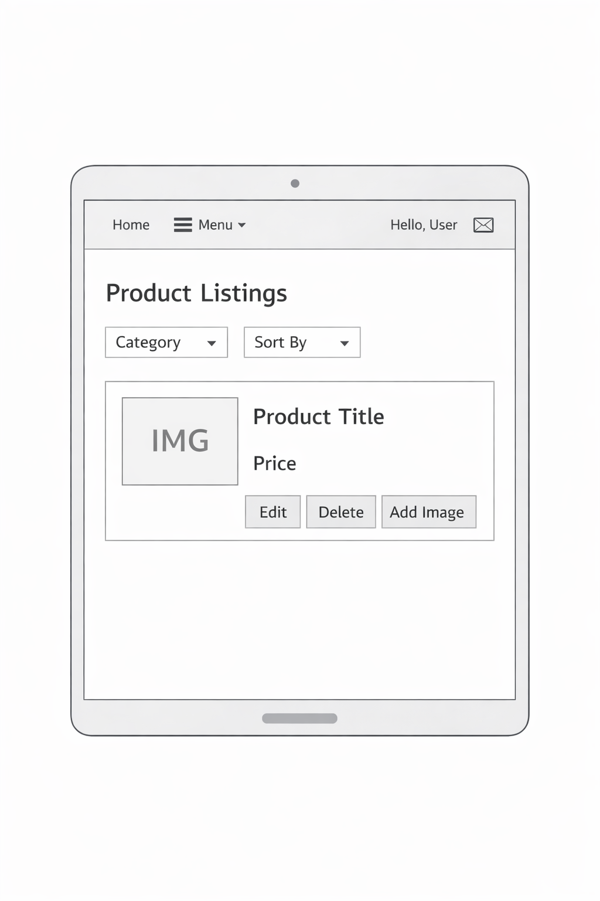

### Laptop

### Desktop

### Group Concepts

Assessment Mapping (Wireframes)
Learning Outcome	Evidence
LO1.1	Responsive layout across desktop, laptop, tablet, and mobile
LO1.5	Documented UX design process using wireframes
LO1	Accessibility-aware layout planning
LO2	UI designed around CRUD workflows
LO3	Navigation reflects authentication state
Features
Authentication & Authorization

    User registration

    Login and logout

    Authentication state reflected in navbar

    Ownership-based access control:

        Only owners can edit or delete their products

Marketplace Functionality

    View all products in a responsive card layout

    Create new products (authenticated users)

    Update and delete owned products only

    Category assignment and display

    Cloudinary-backed image upload

    Primary image logic

    Product carousel with device-based imagery

Notifications (Django Messages)

    Registration confirmation

    Product created confirmation

    Product updated confirmation

    Product deleted confirmation

    Image upload confirmation

    Image deletion confirmation

Technologies Used
Front-End

    HTML5

    CSS3

    Bootstrap 5

    Google Fonts (Poppins)

Back-End

    Python 3.11

    Django 4.2 (LTS)

    Django ORM

Database

    SQLite (development)

    Heroku Postgres (production)

Media & Static Files

    Cloudinary (media storage)

    Whitenoise (static files)

Tools & Platforms

    VS Code

    Git & GitHub

    Heroku

    Gunicorn

Data Model
Product Model

    owner — ForeignKey to User

    category — ForeignKey to Category (nullable)

    title — CharField

    description — TextField

    price — DecimalField

    created_at — DateTimeField

    updated_at — DateTimeField

Category Model

    name — unique category name

    slug — unique slug

    created_at — timestamp

ProductImage Model

    product — ForeignKey to Product

    uploaded_by — ForeignKey to User

    image — CloudinaryField

    alt_text — accessibility alt text

    is_primary — primary image flag

    created_at — timestamp

ERD Diagram

docs/erd.png

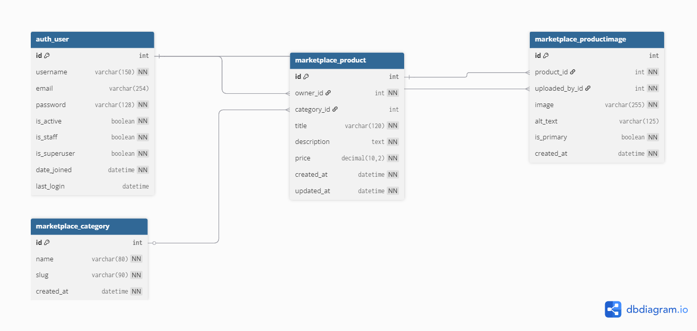

Relationships

    User → Product (one-to-many)

    Category → Product (one-to-many)

    Product → ProductImage (one-to-many)

    User → ProductImage (one-to-many)

Primary image resolution is handled via ordering:
(-is_primary, -created_at)
Agile Methodology
Epics

    User Authentication & Registration

    Marketplace CRUD Functionality

    Media Uploads (Cloudinary)

    Notifications & User Feedback

    UX Design & Responsiveness

    Deployment & Security

    Automated Testing

    Documentation & Evidence

ITMarket — Full User Story Catalogue (MoSCoW)
MUST HAVE — Core Marketplace Platform (Delivered Scope)

These stories define the minimum viable product (MVP) and were fully implemented.

Epic: User Authentication & Security
US-M1 — User Registration

As a visitor
I want to create an account
So that I can access marketplace features

Acceptance Criteria

Registration form available

User account created securely

Validation errors shown clearly

Success confirmation message displayed

US-M2 — User Login

As a registered user
I want to log in to my account
So that I can access protected functionality

Acceptance Criteria

Login page available

Credentials validated securely

Error messages for invalid login

Login state reflected in UI

US-M3 — User Logout

As a logged-in user
I want to log out of my account
So that my session is securely terminated

Acceptance Criteria

Logout button visible when logged in

Session ends securely

User redirected to homepage

US-M4 — Login State Visibility

As a user
I want to see my login status
So that I understand my session state

Acceptance Criteria

Navbar updates based on login state

Username shown when logged in

Login/Register hidden for authenticated users

US-M5 — Access Control

As a user
I want protected pages to require authentication
So that unauthorised access is prevented

Acceptance Criteria

login_required enforced on protected views

Redirect to login when unauthenticated

Access denied for unauthorised users

Epic: Marketplace Product Management (CRUD)
US-M6 — View Products

As a visitor
I want to browse marketplace products
So that I can explore available listings

Acceptance Criteria

Product list loads successfully

Card layout displays product details

Responsive across devices

US-M7 — Create Product

As a logged-in user
I want to create a product listing
So that I can sell items

Acceptance Criteria

Product creation form available

Validation enforced

Only authenticated users can create

Success message displayed

US-M8 — Update Product

As a product owner
I want to edit my product listing
So that I can update its details

Acceptance Criteria

Only owner can edit

Form pre-filled with product data

Validation applied

Success message displayed

US-M9 — Delete Product

As a product owner
I want to delete my product listing
So that I can remove unwanted items

Acceptance Criteria

Only owner can delete

Confirmation page displayed

Product removed from database

Success message displayed

US-M10 — Ownership Enforcement

As a user
I want my products protected from other users
So that no one else can modify them

Acceptance Criteria

Edit/Delete buttons hidden for non-owners

Server-side ownership checks enforced

Unauthorized access blocked

Epic: Media Uploads (Cloudinary)
US-M11 — Upload Product Images

As a product owner
I want to upload images for my product
So that buyers can see what I am selling

Acceptance Criteria

Image upload form available

Images stored via Cloudinary

Image displayed on product card

Validation applied

US-M12 — Primary Product Image

As a product owner
I want to set a primary image
So that my product has a main display image

Acceptance Criteria

Only one primary image per product

New primary image replaces old one

Primary image shown on product card

US-M13 — Delete Product Images

As a product owner
I want to delete product images
So that I can remove unwanted media

Acceptance Criteria

Only owners can delete images

Delete confirmation page

Image removed from Cloudinary

Success message displayed

Epic: Notifications & Feedback
US-M14 — User Feedback Messages

As a user
I want confirmation messages after actions
So that I know my actions were successful

Acceptance Criteria

Messages shown for:

Registration

Login

Product create/update/delete

Image upload/delete

Messages styled clearly

Epic: Deployment & Security
US-M15 — Secure Production Deployment

As a project owner
I want the application deployed securely
So that users can access it safely

Acceptance Criteria

Heroku deployment successful

PostgreSQL database configured

DEBUG=False in production

Secrets stored in environment variables

US-M16 — Production Parity

As a project owner
I want production to match development
So that users experience consistent behaviour

Acceptance Criteria

Same features locally and in production

Auth works in production

Image uploads work in production

Epic: Usability & Responsiveness
US-M17 — Responsive UI

As a user
I want the site to work on all devices
So that I can use it on mobile, tablet, or desktop

Acceptance Criteria

Responsive Bootstrap grid

Mobile navigation

Touch-friendly UI

US-M18 — Accessible UI

As a user
I want an accessible interface
So that users with disabilities can use the site

Acceptance Criteria

Semantic HTML

Accessible forms

Alt text on images

WCAG colour contrast

Epic: Testing & Quality Assurance
US-M19 — Automated Test Coverage

As a project owner
I want automated tests for core functionality
So that regressions are prevented

Acceptance Criteria

CRUD tests

Ownership security tests

Message tests

Image logic tests

US-M20 — Quality Assurance Verification

As a project owner
I want to verify all features before submission
So that the system meets assessment requirements

Acceptance Criteria

All tests pass

Production site verified

README complete

Screenshots captured

SHOULD HAVE — Enhancements (Next Iteration)
US-S1 — Product Search

As a user
I want to search for products
So that I can find items quickly

US-S2 — Product Filtering

As a user
I want to filter by category and price
So that I can narrow my results

US-S3 — Product Sorting

As a user
I want to sort by price or newest
So that I can browse efficiently

US-S4 — User Profile Page

As a user
I want a profile page
So that I can view my products

US-S5 — Admin Moderation Dashboard

As an admin
I want to moderate listings
So that inappropriate content can be removed

COULD HAVE — Future Expansion
US-C1 — Product Reviews

As a buyer
I want to leave reviews
So that sellers build reputation

US-C2 — Wishlist

As a user
I want to save favourite products
So that I can view them later

US-C3 — Messaging Between Users

As a buyer
I want to message sellers
So that I can ask questions

US-C4 — Notifications by Email

As a user
I want email notifications
So that I don’t miss updates

US-C5 — API Endpoints

As a developer
I want an API
So that mobile apps can be built

WON'T HAVE — Out of Scope (Current Project)
US-W1 — Payments & Checkout

As a buyer
I want to pay for products online
So that I can complete purchases

(Out of scope due to security, compliance, and time constraints)

US-W2 — Shipping & Order Tracking

As a buyer
I want shipping integration
So that I can track deliveries

(Out of scope — marketplace only, not full e-commerce)

US-W3 — Mobile App

As a user
I want a mobile app
So that I can browse on my phone

(Out of scope — web application only)

US-W4 — Real-Time Chat

As a buyer
I want real-time chat
So that I can talk instantly to sellers

(Out of scope — requires WebSocket infrastructure)

US-W5 — AI Recommendations

As a buyer
I want product recommendations
So that I discover new items

(Out of scope — requires data pipeline and ML model)

Kanban Tracking

Project tracked using GitHub Issues + GitHub Projects (Kanban).

Workflow:
Backlog → To Do → In Progress → Done

Incremental development with traceable commits.
Automated Testing
Testing Approach

Automated tests using Django TestCase covering:

    Models

    Views

    Permissions

    CRUD workflows

    Messages

    Image rules

Automated Test Coverage (Examples)
Area	What is tested	Evidence
Product List	Page loads and displays listing	test_product_list_page_loads
Create Product	Login required, creation works	test_owner_can_create_product_and_sees_message
Update Product	Owner can update	test_owner_can_update_product_and_sees_message
Delete Product	Owner can delete	test_owner_can_delete_product_and_sees_message
Image Upload	Upload works	test_owner_can_upload_image_and_sees_message
Primary Image Rule	Only one primary image	test_primary_image_rule_unsets_previous_primary
Image Security	Non-owner blocked	test_non_owner_cannot_delete_image
Running Tests

python manage.py test

Version Control
Git Strategy

    Regular commits reflecting incremental progress

    Meaningful commit messages

    Traceable Agile development history

Secure Code Management

    .env excluded via .gitignore

    Secrets stored in Heroku Config Vars

    Production runs with DEBUG=False

Deployment (Heroku)
Platform

    Heroku web hosting + Heroku Postgres

Deployment Steps

    Create Heroku app

    Add Heroku Postgres add-on

    Set Config Vars:

        SECRET_KEY

        DEBUG=False

        CLOUDINARY_URL

    Connect GitHub repo and enable auto deploy

    Run migrations

    Collect static files

    Verify production behaviour

Production Settings

    DEBUG=False

    Environment variables for secrets

    Whitenoise for static files

    Gunicorn production server

    Cloudinary for persistent media storage

Bug Fix Log
Authentication Template Resolution Fix

Resolved template discovery and authentication-related 500 errors by:

    Ensuring TEMPLATES['DIRS'] includes BASE_DIR / "templates"

    Ensuring login template exists at templates/registration/login.html

    Wiring django.contrib.auth.urls correctly

Result: Authentication workflows render reliably locally and on Heroku.
Screenshots

## Screenshots

Screenshots are stored in `docs/screenshots/`:

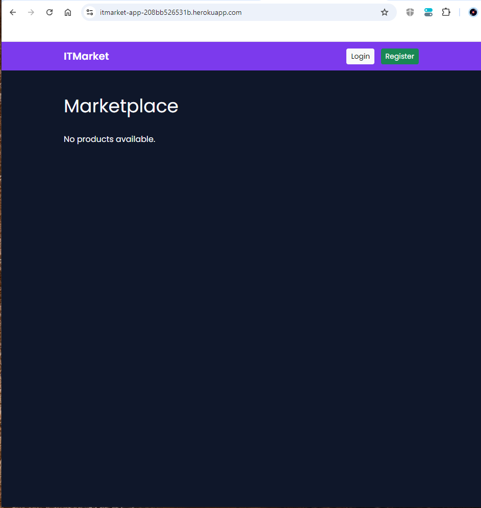
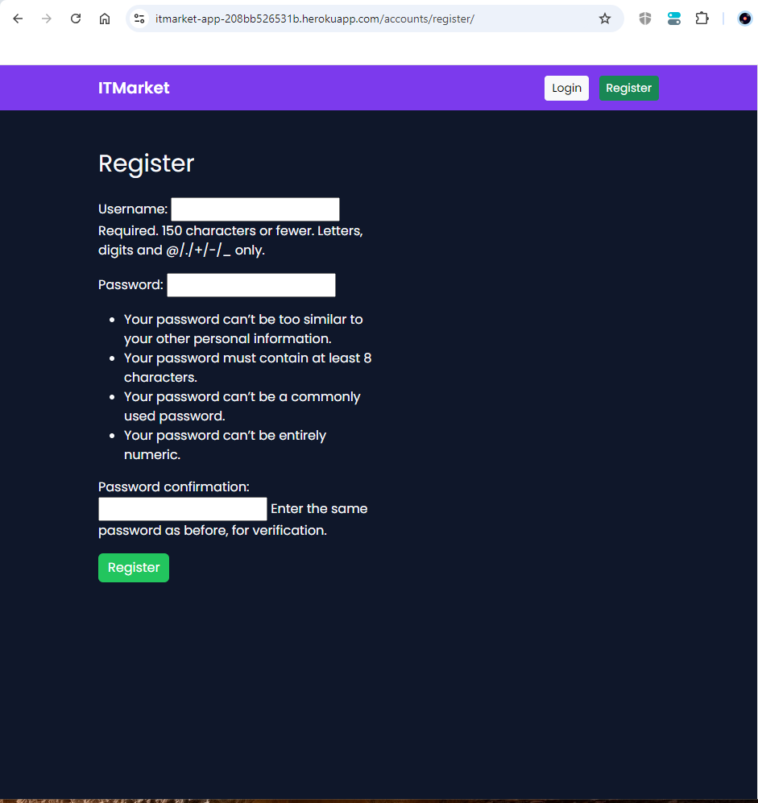
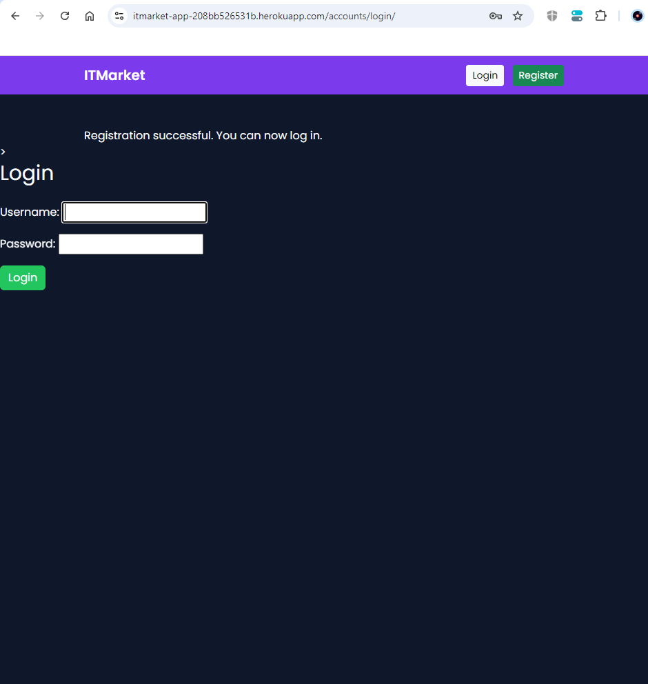
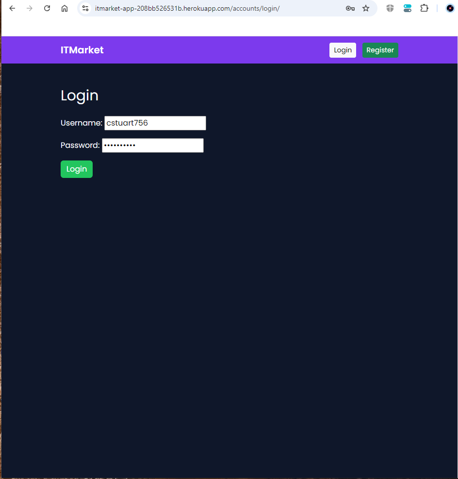
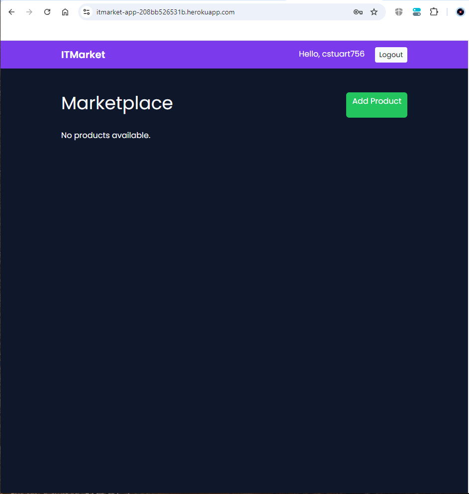
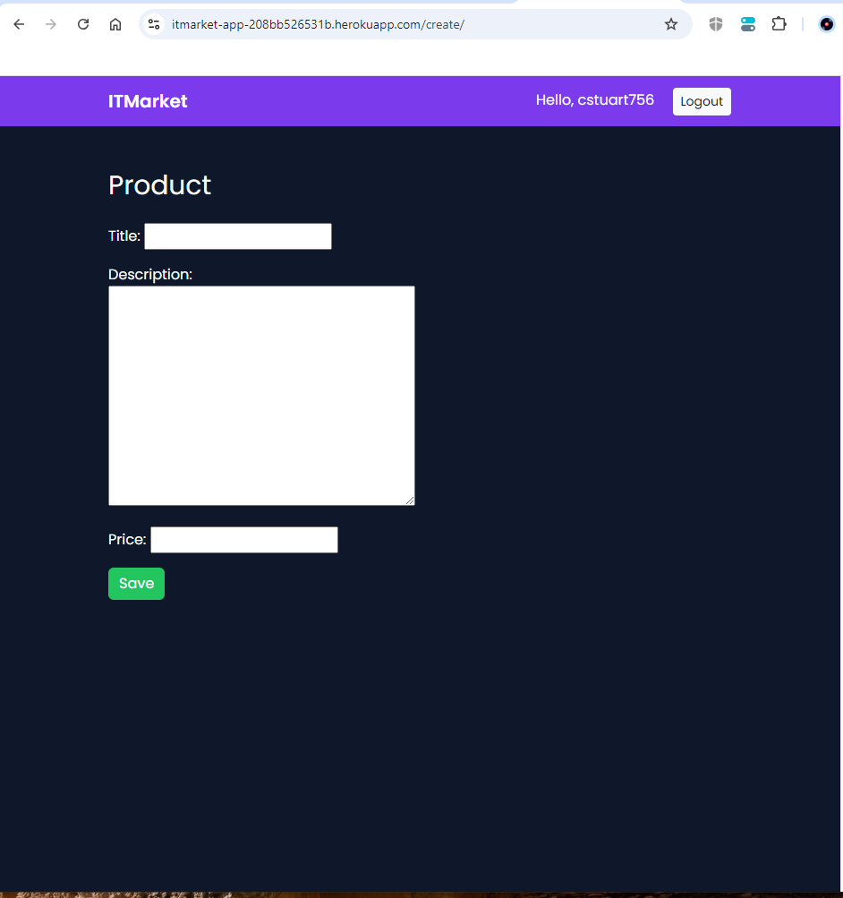
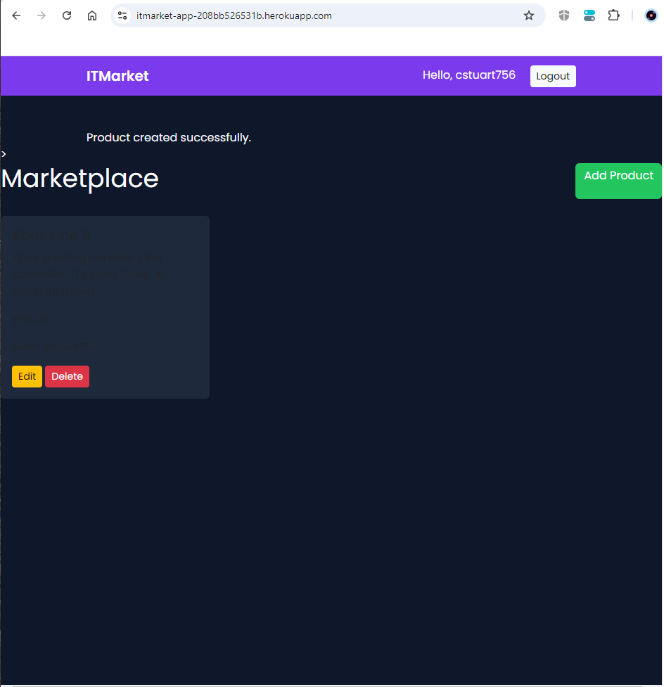

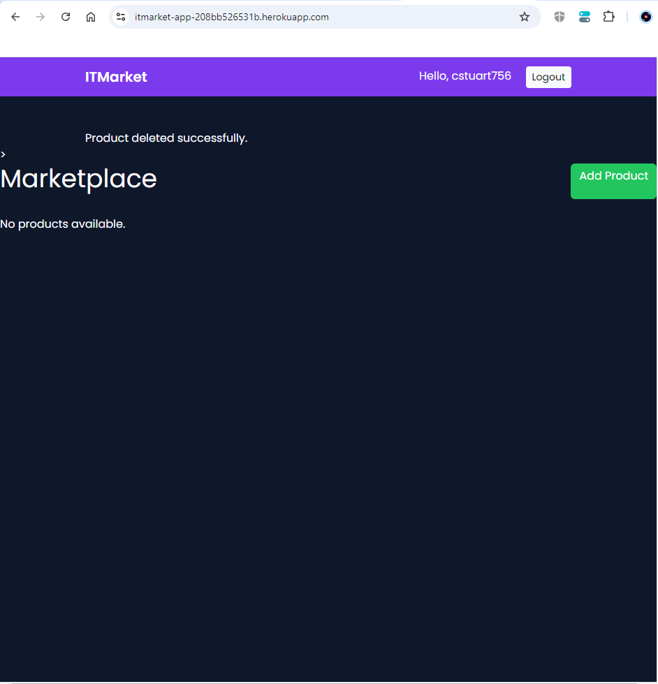

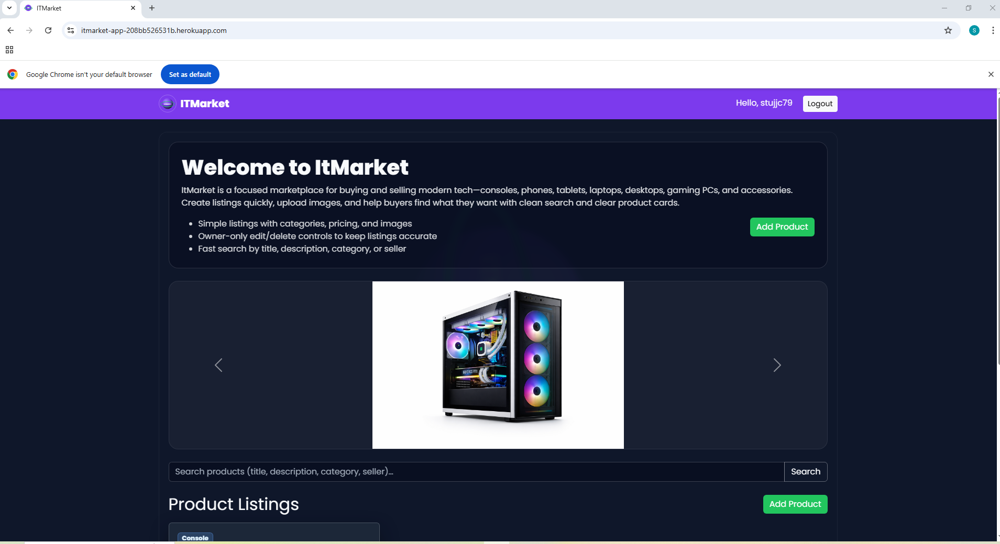

AI-Assisted Development (Reflection)

AI tools were used strategically to:

    Generate Django boilerplate aligned to project goals

    Produce unit tests for CRUD flows and security

    Debug deployment and template resolution issues

    Improve UX implementation decisions

    Accelerate iteration while maintaining quality

All AI-generated outputs were reviewed, adapted, and validated through automated testing and manual verification.
Future Enhancements

    Advanced search and filtering

    Product image galleries (enhanced browsing experience)

    Admin moderation dashboard

    Email notifications

    User messaging system

References

    Django Documentation — https://docs.djangoproject.com/

    Bootstrap Documentation — https://getbootstrap.com/docs/

    Google Fonts — https://fonts.google.com/

    WCAG Guidelines — https://www.w3.org/WAI/standards-guidelines/wcag/

    Heroku Dev Center — https://devcenter.heroku.com/

    Cloudinary Documentation — https://cloudinary.com/documentation

Author

Stuart Carey
AI-Augmented Full-Stack Bootcamp – Individual Capstone Project
Declaration

This project is my own original work. AI tools were used strictly as development assistants. All architecture, security decisions, business logic, and implementation choices were designed, reviewed, and validated independently.
